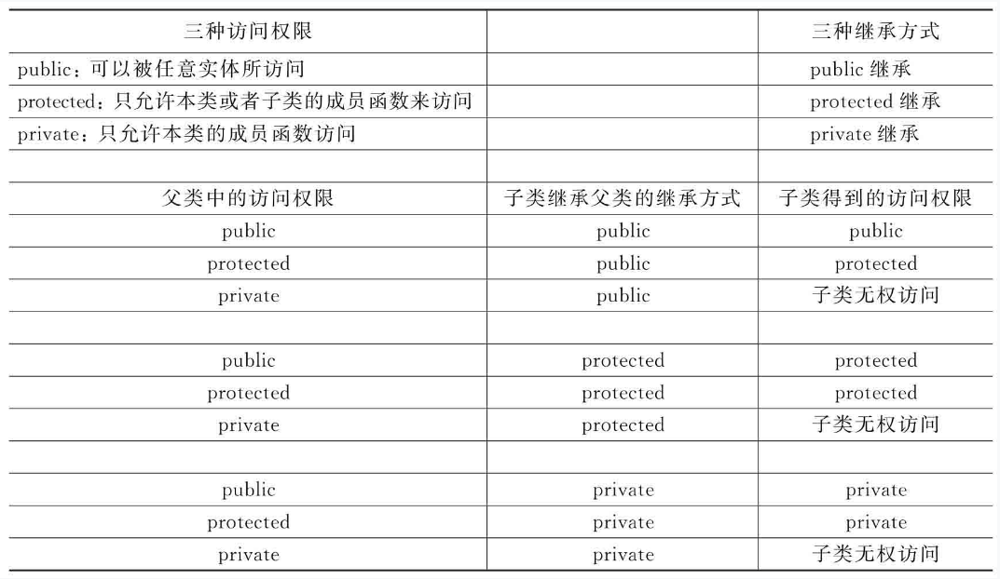

# C++新经典笔记

> 《c++新经典》笔记

## 第13章 C++基本语言

C++标准回顾：

* C++98(1.0)标准C++，传统C++
* C++11，现代C++
  + C++14, 17, 20
* C++23
* C++26

## 第14章 类

### 14.1　成员函数、对象复制与私有成员

类包括成员变量和成员函数。

注意：class中成员默认private，struct中默认public

类允许被重定义。在多个文件中重复声明头文件。

对象复制可以使用： = () {} ={}。

类的私有成员变量和私有成员函数都只能在类的成员函数内调用，外界是无法直接调用的。

### 14.2　构造函数详解、explicit与初始化列表

区分成员函数的定义、声明、实现。

构造函数的目的（存在的意义）就是初始化类对象的数据成员（成员变量）。

执行复制对象操作时调用拷贝构造函数而非构造函数。

#### **默认参数**

在具有多个参数的函数中指定参数默认值时，默认参数都必须出现在非默认参数的右侧，一旦开始为某个参数指定默认值，则它右侧的所有参数都必须指定默认值。

#### **隐式转换和explicit**

当类出现单参数构造函数时，以下写法不报错。因为单参数构造函数执行了隐式类型转换。

```cpp
class Time {
    Time(int var);
    explicit Time(int var); //显示初始化
}
Time::Time(int var){
    ...
}
Time t = new Time(1);
Time t = new Time｛1｝;
Time t(1);
Time t{1}
// 隐式初始化(构造并初始化)
Timer t = 1;
Time t = ｛1｝；
Timer t = (1,2,3,4,5);
void func(1); // void func(Timer t)
```

如果构造函数声明中带有explicit（显式），则这个构造函数只能用于初始化和显式类型转换。

#### **构造函数列表初始化**

优点：初始化列表的执行是在函数体执行之前就执行了的。对于类类型的成员变量，使用初始化列表的方式初始化比使用赋值语句初始化效率更高（因为少调用了一次甚至几次该成员变量相关类的各种特殊成员函数，如构造函数等）。

```cpp
Time::Time(int tmphour,int tmpminute, int tmpsec)： Hour(tmphour), Minute(tmpminute), Sec(tmpsec){
    ...
}
```

注意初始化顺序是按类成员定义顺序执行的。

### 14.3　inline、const、mutable、this与static

#### **inline**

直接在类在定义的成员函数会被当作inline函数来处理。

内联函数只是对编译器的建议，能不能inline成功，依旧取决于编译器，所以，成员函数的定义体尽量写得简单，以增加被inline成功的概率。

#### **成员函数末尾const**

这个成员函数末尾的const起什么作用呢？告诉系统，这个成员函数不会修改该对象里面的任何成员变量的值等，也就是说，这个成员函数不会修改类对象的任何状态。

```cpp
#include <iostream>
using namespace std;
class Time{
public:
  Time();
  ~Time();
  Time(int tmphour, int tmpminute, int tmpsec): Hour(tmphour), Minute(tmpminute), Sec(tmpsec) {}
  int Hour;
  int Minute;
  int Sec;
  void addHour() {
    Hour += 10;
  }
  void noone() const {
    // Hour += 10;
    cout << "const func" << endl;
  }
private:
  
};

Time::Time() {
  Hour = 0;
  Minute = 0;
  Sec = 0;
}
Time::~Time() {
}
int main (int argc, char *argv[]) {
  const Time abc;
  // abc.noone();
  // abc.addHour();
  abc.noone();
  cout << abc.Hour << endl;
   
  return 0;
}
```

#### **mutable**

mutable可以突破const的限制，让const对象可以在const结尾的成员函数中修改非const成员变量的值。

注意：如果把const从成员函数结尾去掉的话，const对象依然不能访问非const结尾的成员函数(对象含有与成员 函数 "Time::addHour" 不兼容的类型限定符)

引入一个mutale变量, 在const结尾的成员函数中可以修改改变量的值，当然普通对象也可以修改mutable变量。

```cpp
class Time {
public:
    mutable int myHour;
    void noone() const {
        // Hour += 10;
        cout << "const func" << endl;
        myHour = 10;
    }
};
// main()
const Time abc;
abc.noone();
cout << abc.myHour << endl; // 10
```

#### **返回自身对象的引用——this**

this用在成员函数中是一个隐藏起来的函数参数，表示的是指向本对象的指针。那么，*this表示该指针指向的对象也就是本对象。换句话说，*this表示调用这个成员函数的那个对象。

关于this有一些说法，请注意：

* （1）this指针只能在成员函数（普通成员函数，后面会讲解比较特殊的成员函数）中使用，全局函数、静态函数等都不能使用this指针。
* （2）在普通成员函数中，this是一个指向非const对象的指针常量。例如，类类型为Time，那么this就是Time*const类型的指针（指针常量），表示this只能指向Time对象。笔者认为：“指针常量”这个名字起的不好，因为这个名字听起来更像是一个常量而不是一个指针。*
* （3）在const成员函数中，this指针是一个指向const对象的const指针。例如，类类型为Time，那么this就是constTime*const类型。

使用this串联成员函数:

```##cpp
// class
Time &Time::rtnhour(int tmphour)
{
  Hour += tmphour; 
  return *this; 
}
Time &Time::rtnminute(int tmpminute)
{
  Minute += tmpminute; 
  return *this; 
}
// main
Time mytime; 
mytime.rtnhour(3).rtnminute(4); 

```

#### static成员

static成员变量（静态成员变量），其特点是：不属于某个对象，而是属于整个类，这种成员变量可以通过对象名来修改（也可以通过类名来修改），但一旦通过该对象名修改了这个成员变量的值，则在其他该类对象中也能够直接看到修改后的结果。

不仅对于成员变量，成员函数也可以在其前面增加static关键字，增加了这种关键字的成员函数同样不隶属于某个对象，而是隶属于整个类，调用的时候可以用“类名::成员函数名（……）”这种调用方式。当然，在static成员函数中，一般也只能操作和类相关的成员变量（static成员变量），不能操作和对象相关的成员变量。

静态成员变量和静态成员函数定义的时候并未分配内存，需要定义。一般在源文件开头定义静态成员变量，且静态成员函数实现不需要加static，不能在静态成员函数使用非静态成员变量。依旧可以用“对象名.静态成员函数名”的方式来调用静态成员函数。

```cpp
// class
class Time {
public:
    static int mystatic;
    static void mystaticfuc(int testvalue);
};
int Time::mystatic = 10;
void Time::mystaticfuc(int testvalue)
{
  mystatic += testvalue;
}
// main
cout << Time::mystatic << endl; // 10
Time::mystaticfuc(10);
cout << Time::mystatic << endl; // 20
```

14.3代码

```cpp
#include <iostream>
using namespace std;
class Time {
public:
  Time();
  ~Time();
  Time(int tmphour, int tmpminute, int tmpsec)
      : Hour(tmphour), Minute(tmpminute), Sec(tmpsec) {}
  int Hour;
  int Minute;
  int Sec;
  mutable int myHour;
  void addHour() {
    Hour += 10;
    myHour = 10;
  }
  void noone() const {
    // Hour += 10;
    cout << "const func" << endl;
    myHour = 10;
  }
  Time &rtnhour(int tmphour);
  Time &rtnminute(int tmpminute);
  static int mystatic;
  static void mystaticfuc(int testvalue);

private:
};
Time &Time::rtnhour(int tmphour) {
  Hour += tmphour;
  return *this;
}
Time &Time::rtnminute(int tmpminute) {
  Minute += tmpminute;
  return *this;
}
Time::Time() {
  Hour = 0;
  Minute = 0;
  Sec = 0;
}
Time::~Time() {}
int Time::mystatic = 10;
void Time::mystaticfuc(int testvalue) { mystatic += testvalue; }

void test14_4() {

}
int main(int argc, char *argv[]) {
  // Time abc;
  // abc.addHour();
  // abc.addHour();
  // abc.noone();
  // cout << abc.myHour << endl;
  Time mytime;
  // mytime.rtnhour(3).rtnminute(4);
  // mytime.rtnhour(3);
  cout << Time::mystatic << endl;
  Time::mystaticfuc(10);
  cout << Time::mystatic << endl;
  cout << mytime.mystatic << endl;
  return 0;
}
```

### 14.4 类内初始化、默认构造函数、“=default；”和“=delete；”

#### 传参技巧

```cpp
void WriteTime(Time &mytime) {
  // 类相关非成员函数
  // 传引用,可以避免对象复制产生的损耗
  cout << mytime.Hour << endl;
}
```

#### 类内初始化(C++11)

可以为新成员变量提供一个类内的初始值。如果使用构造函数初始化列表或在构造函数中给Second值，该值会覆盖掉初始值。

```cpp
// class
int Second{10};
```

#### const成员变量的初始化

对于类的const成员，只能使用初始化列表来初始化，而不能在构造函数内部进行赋值操作。

#### 默认构造函数

没有参数的构造函数称为默认构造函数。
一旦程序员书写了自己的构造函数，那么在创建对象的时候，必须提供与书写的构造函数形参相符合的实参，才能成功创建对象。

#### =default, =delete

=default, “=default”特性——编译器能够为这种“=default”的函数自动生成函数体（等价于空函数体“{}”）。

```cpp
// class 
Time()=default;
```

=delete, 代码行禁止编译器生成“合成的默认构造函数

```cpp
// class
Time()=delete;
```

### 14.5　拷贝构造函数

对象定义时如果有复制发生，会调用拷贝构造函数。如果自定义拷贝构造函数，编译器不会默认生成。

```cpp
Time(const Time &tmptime, int a = 3);
```

拷贝构造函数一般参数为const，不声明explicit。单参数构造函数声明explicit。

```cpp
Time mytime;              // 默认构造函数
Time mytime2 = mytime;    // 拷贝构造函数 ,隐式转换
Time mytime3(mytime);     // 拷贝构造函数
Time mytime4{mytime};     // 拷贝构造函数
Time mytime5 = {mytime};  // 拷贝构造函数 ,隐式转换
Time mytime6;             // 默认构造函数
mytime6 = mytime5;        // 赋值运算符，不调用构造函数
```

当类中包含类成员时，会首先调用类成员的拷贝构造函数，如果没有写编译器生成。

类对象作为函数参数时，调用函数传入实参会发生对象拷贝操作，此时会调用拷贝构造函数。而如果在函数中创建一个临时局部对象并返回，需要注意这里依然有拷贝操作，即创建临时对象再返回。

### 14.6　重载运算符、拷贝赋值运算符与析构函数

#### 重载运算符

运算符如果想要应用于类对象中，就需要对这些运算符进行重载，也就是以这些运算符名为成员函数名来写成员函数，以实现这些运算符应用于类对象时应该具备的功能。
所以，重载运算符本质上是函数，函数的正式名字是：operator关键字后面接这个运算符。既然本质上是函数，那么这个函数当然也就具有返回类型和参数列表。

```cpp
bool Time::operator==(Time& t) {
  if (Hour == t.Hour) {
    return true;
  }
  return false;
}
```

如果一个类没有重载赋值运算符，编译器可能会重载一个“赋值运算符”。如何类中的类对象成员如果有赋值运算符重载，编译器在生成时会调用。

#### 拷贝赋值运算符（赋值运算符）

拷贝构造函数和对象的赋值运算符都能完成对象拷贝操作，但二者原理不同。
* 拷贝构造函数：通过实现拷贝构造函数实现对象拷贝
* 赋值运算符：通过重载=运算符实现对象拷贝

```cpp
// main
Time mytime6;             // 默认构造函数
mytime6 = mytime5;
// class
Time& Time::operator=(const Time& t) {
  Hour = t.Hour;
  Minute = t.Minute;
  // ...
  return *this;
}
```

#### 析构函数

如果在构造函数中new内存，需要在析构函数中delete掉。

析构函数无参数，不能重载。

#### 几个话题

**构造函数的成员初始化**

对于类类型成员变量的初始化，能放在构造函数的初始化列表里进行的，千万不要放在构造函数的函数体里来进行，这样可以节省很多次不必要的成员函数调用，从而提高不少程序的执行效率。

```cpp
// Tmpclass
Tmpclass(int t=10):tmp(t) { cout << "tmp 构造函数" << endl; }
// Time
Time(int tmphour, int tmpminute, int tmpsec)
    : Hour(tmphour), Minute(tmpminute), Second(tmpsec),tmpclass(12) {}
```

**析构函数的成员销毁**

析构函数在函数体中销毁对象->系统完成对象中的成员变量销毁。

成员变量的初始化和销毁顺序:

成员变量初始化的时候是在类中先定义的成员变量先进行初始化，销毁的时候是先定义的成员变量后销毁。

new和delete创建和销毁对象的方式，必须配对使用

### 14.7　子类、调用顺序、访问等级与函数遮蔽

子类是对父类的继承。

父类构造函数要比子类构造函数先执行。

访问等级
现在对这三种访问权限修饰符（专用于修饰类中的成员变量、成员函数）进行一下总结：

* public：可以被任意实体所访问。
* protected：只允许本类或者子类的成员函数来访问。
* private：只允许本类的成员函数访问。

继承总结：
* （1）子类public继承父类，则父类所有成员在子类中的访问权限都不发生改变；
* （2）protected继承将父类中public成员变为子类的protected成员；
* （3）private继承使得父类所有成员在子类中的访问权限变为private；
* （4）父类中的private成员不受继承方式的影响，子类永远无权访问；
* （5）对于父类来讲，尤其是父类的成员函数，如果你不想让外面访问，就设置为private；如果你想让自己的子类能够访问，就设置为protected，如果你想公开，就设置为public。



函数遮蔽

父类与子类出现同名成员函数的情况
1. 子类重载父类成员函数
2. 在子类中使用using声明，引入父类所有的成员函数
  

```cpp
  // Human
  void samenamefunc() { cout << "Human samename" << endl; }
  void samenamefunc(int a) { cout << "Human samename2" << endl; }
  // Men 
  using Human::samenamefunc;
  void samenamefunc() {
    Human::samenamefunc();
    samenamefunc(10);
    cout << "Men samename" << endl;
  }
  // main
  Men men;
  men.samenamefunc();
  men.samenamefunc(10); 
  men.Human::samenamefunc();
  ```

### 14.8　父类指针、虚/纯虚函数、多态性与析构函数

#### 父类指针

注意：父类指针没有办法调用子类的成员函数

#### 虚函数

只定义一个父类对象指针，就能够调用父类以及各个子类的同名成员函数。

但是对这个同名同参的成员函数有要求：在父类中，这个成员函数的声明的开头必须要增加virtual关键字声明，将该成员函数声明为虚函数。

在实现代码中，不需要在前面增加virtual关键字。

```cpp
// Human
virtual void eat();

void Human::eat() { cout << "人类喜欢吃各种食物" << endl; }

// Men
virtual void eat() override;

void Men::eat() { cout << "男人喜欢吃面食" << endl; }

// Women 
virtual void eat() override;

void Women::eat() { cout << "女人喜欢吃面食" << endl; }

// main
Human* phuman = new Men;
phuman->eat();
delete phuman;
phuman = new Women;
phuman->eat();
delete phuman;

phuman = new Human;
phuman->eat();
delete phuman;
```

为了避免在子类中写错虚函数，在C++11中，可以在函数声明所在行的末尾增加一个override关键字。注意，这个关键字是用在子类中，而且是虚函数专用的。
与override关键字相对的还有一个final关键字，final关键字也是用于虚函数和父类中的。如果在函数声明的末尾增加final，那么任何在子类中尝试覆盖该成员函数的操作都将引发错误。

virtual关键字定义的虚函数的作用了。总结一下：
* （1）用父类的指针调用一个虚成员函数时，执行的是`动态绑定`的eat函数。什么叫动态绑定呢？所谓动态，表示的就是在程序运行的时候（运行到调用eat函数这行代码时）才能知道调用了哪个子类的eat函数（虚成员函数）。读者知道，一个函数如果不去调用，编码时可以只写该函数的声明部分，不写该函数的定义部分。但是虚函数，因为是在程序运行的时候才知道调用了哪个虚函数，所以虚函数必须写它的定义部分（以备编译器随时使用随时就存在），否则会编译出错。可以看到，程序运行的时候，作为父类的指针phuman，如果new的是Men子类对象（也叫实例），那么调用的eat函数就是Men类的虚函数eat；如果new的是Women子类对象，那么调用的eat函数就是Women类的虚函数eat，这就叫动态绑定——运行的时候（根据new的是哪个类的对象）才决定phuman调用哪个eat函数。
* （2）如果不是用phuman父类类型指针，而是用普通对象来调用虚函数，那虚函数的作用就体现不出来了，因为这就不需要运行时（根据new的是哪个类的对象）决定绑定哪个eat函数，而是在编译的时候就能确定。

#### 多态性

多态性的解释有如下两方面：
* （1）体现在具有继承关系的父类和子类之间。子类重新定义（覆盖/重写）父类的成员函数eat，同时父类和子类中又把这个eat函数声明为了virtual虚函数。
* （2）通过父类的指针，只有到了程序运行时期，根据具体执行到的代码行，才能找到动态绑定到父类指针上的对象（new的是哪个具体的对象），这个对象有可能是某个子类对象，也有可能是父类对象，而后，系统内部实际上是要查类的“虚函数表”，根据虚函数表找到函数eat的入口地址，从而调用父类或者子类的eat函数，这就是运行时期的多态性。

#### 纯虚函数与抽象类

纯虚函数是在父类中声明的虚函数，它在父类中没有函数体（或者说没有实现，只有一个声明），要求任何子类都要定义该虚函数自己的实现方法，父类中实现纯虚函数的方法是在函数原型后面加“=0”，或者可以说成是在该虚函数的函数声明末尾的分号之前增加“=0”。

抽象类：这种带有纯虚函数的类（Human2）就叫抽象类。抽象类不能用来生成对象，主要目的是统一管理子类（或者说建立一些供子类参照的标准或规范）。

```cpp
// class
class Human2 {
 public:
  virtual void eat() = 0;
};
class Men2 : public Human2 {
  virtual void eat() {
    cout <<"Men2"<<endl;
  }
};
// main
// Human2* phuman2 =new Human2; // 报错
Human2* phuman3 = new Men2;
phuman3->eat();
```

注意：
* （1）含有纯虚函数的类叫抽象类。抽象类不能用来生成对象，主要当作父类用来生成子类。
* （2）子类中必须要实现父类（抽象类）中定义的纯虚函数（否则就没法用该子类创建对象——创建对象就会编译错误）。

抽象类理解：
（1）抽象类不是必须用，不用当然也可以。
（2）抽象类中的虚函数不写函数体，而是推迟到子类中去写。抽象类（父类）就可以“偷懒”少写点代码。
（3）抽象类主要是用来做父类，把一些公共接口写成纯虚函数，这些纯虚函数就相当于一些规范，所有继承的子类都要实现这些规范（重写这些纯虚函数）。
 

#### 虚析构函数

父类的析构函数一般写成虚函数。

```cpp
virtual ~Human();
```

“为什么父类（基类）的析构函数一定要写成虚函数”的问题时，一定要慎重回答，简而言之的答案就是：唯有这样，当delete一个指向子类对象的父类指针时，才能保证系统能够依次调用子类的析构函数和父类的析构函数，从而保证对象（父指针指向的子对象）内存被正确地释放。

### 14.9　友元函数、友元类与友元成员函数

#### 友元函数

友元函数本身是一个函数，通过将其声明为某个类的友元函数，它就能够访问这个类的所有成员，包括任何用private、public、protected修饰的成员。

```cpp
// Men class
friend void func(const Men &m);
public:
  void funcmen() const
  {
    cout << "funcmen" << endl;
  }

private:
  void funcmen2() const
  {
    cout << "funcmen2" << endl;
  }
// func
void func(const Men &m)
{
  m.funcmen();
  m.funcmen2();
}
// main
Men men;
men.funcmen();
func(men);
```

#### 友元类

类还可以把其他类定义成友元类。如果类B是类A的友元类，那么B就可以在B的成员函数中访问类A的所有成员（成员变量、成员函数），而不管这些成员是用什么修饰符（private、protected、public）来修饰的。

每个类都负责控制自己的友元类和友元函数，所以，有一些注意点要说明：

* （1）友元关系是不能被子类继承的。

* （2）友元关系是单向的，例如上面类B是类A的友元类，但这并不表示类A是类B的友元类。

* （3）友元关系也没有传递性，例如类B是类A的友元类，类C是类B的友元类，这并不代表类C是类A的友元类。友元类关系的判断，最终还是要看类定义中有没有对应的friend类声明。

```cpp
// class 
class A
{
  // friend class B;
  friend B::callA(int x, A&a);
private:
  int data;
};
class B
{

public:
  void callA(int x, A &a)
  {
    a.data = x;
    cout << a.data << endl;
  }
};

// 友元类
A a;
B b;
b.callA(10, a);
```

#### 友元成员函数

但是，这种让整个类B成为类A友元类的方式，有点显得太霸道，范围太广泛（影响太广），因为这样做，类B（类A的友元类）的所有成员函数都可以访问类A的私有成员变量。那么，考虑换一种解决方式：不让整个类B成为类A的友元类，而是只让类B中的某些成员函数成为类A的友元函数，这样，只有这些成为了类A友元函数的类B中的成员函数才能访问类A中用private、protected、public修饰的成员。

```cpp
// class 
class A
{
  // friend class B;
  friend B::callA(int x, A&a);
private:
  int data;
};
class B
{

public:
  void callA(int x, A &a)
  {
    a.data = x;
    cout << a.data << endl;
  }
};

// 友元类
A a;
B b;
b.callA(10, a);
```

现在，总结一下友元概念的优缺点。
* （1）优点：允许在特定情况下某些非成员函数访问类的protected或者private成员，从而提出“友元”概念，使访问protected和private成员成为可能。
* （2）缺点：这也破坏了类的封装性（例如本来private修饰的成员用意就是不允许外界访问），降低了类的可靠性和可维护性。

面向对象的三大特性：封装性、继承性、多态性。请注意，面向对象程序设计有哪三个特性也是在C++面试中常考的问题。使用或者不使用友元，可以依据自己的实际需求来决定。

### 14.10　RTTI、dynamic_cast、typeid、type-info与虚函数表
#### RTTI

RTTI（RunTime Type Identification），翻译成中文的意思是“运行时类型识别”。也就是通过运行时类型识别，程序能够使用父类（基类）的指针或引用来检查这些指针或引用所指的对象的实际子（派生）类型。

RTTI可以看作系统提供出来的一种功能，或者说是一种能力。这种功能或者能力通过两个运算符来实现。（1）dynamic_cast运算符：能将父类的指针或者引用安全地转换为子类的指针或者引用。在13.10.2节中提起过该运算符。（2）typeid运算符：返回指针或者引用所指对象的实际类型。

如果想用父类指针调用子类中的这个普通成员函数，如何操作？

- 在父类中将该成员函数定义为虚函数
- RTTI，强转

#### dynamic_cast运算符

dynamic_cast运算符能将父类指针或者引用安全地转换为子类的指针或者引用。

dynamic_cast运算符是帮助开发者做安全检查。

使用dynamic_cast运算符的前提条件是：父类中必须至少有一个虚函数。否则，使用dynamic_cast运算符，要么编译时就会报错（最新编译器），要么无法得到正确的运行结果（较老版本编译器）。


#### typeid

typeid运算符有两种形式：typeid（类型）/typeid（表达式）。通过这个运算符，可以获取到对象的类型信息。这个运算符会返回一个常量对象的引用。这个常量对象的类型一般是标准库类型type_info，其实type_info就是一个类（类类型）。

使用typeid运算符其实是为了比较两个指针是否指向同一种类型。

- 只要两个指针定义时的类型（静态类型）相同（都是Human *），不管它们指向的是父类还是子类实例（不管new的是什么对象），typeid就相等
- 只要两个指针运行时指向的类型相同（new的对象类型相同），typeid就相等，不管它们定义时的类型是否相同

```cpp
Human *phuman = new Men;
Men *p = (Men *)(phuman);
p->funcmen();
try {
  Men *pmen = dynamic_cast<Men *>(phuman);
  pmen->funcmen();
} catch (bad_cast) {
  cout << "转换失败" << endl;
}
Human &q = *phuman;
cout << typeid(*phuman).name() << endl;  // 3Men
cout << typeid(q).name() << endl;        // 3Men

char a[10];
int i;
double b;
cout << typeid(a).name() << endl;  // A10_c
cout << typeid(i).name() << endl;  // i
cout << typeid(b).name() << endl;  // d
```


注意：只有当父类含有虚函数时，编译器才会对typeid中的表达式进行求值，否则，typeid返回的是表达式（参数）定义时的类型（静态类型）。定义时的类型，编译器根本不需要对表达式求值（根本不需要运行代码），在编译阶段就可以知道。

#### type_info类

typeid运算符会返回一个常量对象的引用，这个对象的类型一般是标准库类型type_info，这其实是一个类。

- 成员函数name：用于获取类型名字信息

- 操作符==/!=


#### RTTI与虚函数表

在C++中，如果这个类里要含有虚函数，编译器就会针对该类产生一个虚函数表，虚函数表里有很多表项，每一项都是一个指针，每个指针指向这个类里的各个虚函数的入口地址。

有些编译器比较特殊，虚函数表的第一项并不指向虚函数的入口地址，而是指向这个类所关联的type_info对象信息。另外有些编译器，虚函数表第一项的上面（位于虚函数表第一项之前的内存位置）这个位置依旧是一个指针，指向这个类所关联的type_info对象信息。所以，上面这些范例代码所取得的type_info对象信息其实是来自于这里。


### 14.11　基类与派生类关系的详细再探讨

#### 派生类对象模型简介 

父类-基类 子类-派生类

可以使用基类指针new派生类对象，之间存在类型转换

#### 派生类构造函数

如果构造派生类对象时，基类的构造函数需要参数,通过派生类构造函数的初始化列表可以达到此目的。

```cpp
// class
class A {
 public:
  A(int i) : m_value(i) {}
  virtual ~A() = default;

 private:
  int m_value;
};
class B : public A {
 public:
  B(int i, int j, int k) : A(i), m_value2(k) {}

 private:
  int m_value2;
};

// main
B b{1,2,3};
```
#### 既当父类又当子类

一个类可以既是某个类的父类，同时又是另外一个类的子类。


#### 不想当基类的类

某些类可能不想当基类，C++11中提供了final关键字，加在类名后面，有这个关键字的类，不可以作为基类。
```cpp
class A final {
  // ...
};
```
#### 静态类型与动态类型

静态类型就是变量声明时的类型，静态类型编译的时候就是已知的，如上面代码中的phuman、q，它们的静态类型就是Human类型指针和Human类型引用。


动态类型就是这个指针或者引用所代表的（所表达的）内存中的对象的类型，phuman的动态类型是Men类型指针，而q的动态类型是Men类型引用。显然，动态类型只有在运行的时候（执行到这行代码的时候）才能知道。


所以，只有基类指针或者引用才存在这种静态类型和动态类型不一致的情况。如果不是基类的指针或者引用，那么静态类型和动态类型永远都应该是一致的。


```cpp
  Human *phuman = new Men;
  Human &q = *phuman;
```

#### 派生类向基类的隐式类型转换

编译器会隐式地执行这种派生类到基类的转换。

不存在从基类到派生类的自动类型转换。

#### 父类、子类之间的复制与赋值

第一种情况，将子类对象复制给父类，此时必要执父类的拷贝构造函数，观察执行顺序。

```cpp
// main
Men m;
Human h(m);
// class
Human(const Human &h) { cout << "Human拷贝构造函数" << endl; };
```
```
执行Human()构造函数
执行Men()构造函数
Human拷贝构造函数
执行Human()析构函数
执行Men()析构函数
执行Human()析构函数
```

第二种情况，子类赋值给父类，此时必要执行重载函数，观察执行顺序


```cpp
// main
Men m;
Human h;
h=m;
// class
Human &operator=(const Human &h) {
  m_Age = h.m_Age;
  return *this;
}

```
```
执行Human()构造函数
执行Men()构造函数
执行Human()构造函数
执行Human()析构函数
执行Men()析构函数
执行Human()析构函数
```
用派生类对象为一个基类对象初始化或者赋值时，只有该派生类对象的基类部分会被复制或者赋值，派生类部分将被忽略掉。也就是说，基类部分只做基类部分自己的事，多余的部分不会去操心。
### 14.12　左值、右值、左值引用、右值引用与move

本节先跳过，有点看不懂！！！！😪😪😪

### 14.13　临时对象深入探讨、解析与提高性能手段


