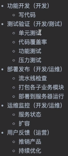

# C++单元测试框架GoogleTest

## 项目开发流程介绍




## googletest使用


```bash
cd googletest
mkdir build && cd build
cmake -DCMAKE_CXX_STANDARD=17 -G "MinGW Makefiles" ..
make
```

通过-G选项可以选择系统中gcc进行编译。

CMakeLists.txt

```cmake
cmake_minimum_required(VERSION 3.5.0)
project(test_demo VERSION 0.1.0 LANGUAGES C CXX)

include_directories(./include DIR_INC)
set(CMAKE_CXX_STANDARD 17)
link_directories(./lib)
add_executable(test_demo main.cpp)
target_link_libraries(test_demo libgtest.a libgtest_main.a libgmock.a libgmock_main.a)	
```

main.cpp

```cpp
#include <iostream>

#include "MockUser.h"
#include "gmock/gmock.h"
#include "gtest/gtest.h"
int add(int a, int b) { return a + b; }
TEST(testCase1, should3_when_give_2_and_1) { EXPECT_EQ(add(2, 1), 3); }

TEST(testCase2, test_get_age) {
  MockUser user;
  EXPECT_CALL(user, getAge)
      .Times(testing::AtLeast(3))
      .WillOnce(testing::Return(200))
      .WillOnce(testing::Return(300))
      .WillRepeatedly(testing::Return(500));
  std::cout << user.getAge() << std::endl;
  std::cout << user.getAge() << std::endl;
  std::cout << user.getAge() << std::endl;
}
int main(int argc, char **argv) {
  std::cout << "Hello, from test_demo!\n";
  testing::InitGoogleTest(&argc, argv);
  return RUN_ALL_TESTS();
}
```


## 参考

[C/C++项目实战（Google Test 测试框架）](https://www.bilibili.com/video/BV1BB4y147Nv)

[googletest-github](https://github.com/google/googletest/)
